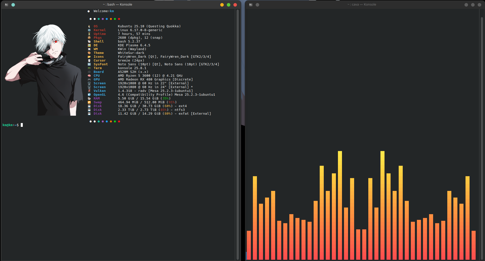
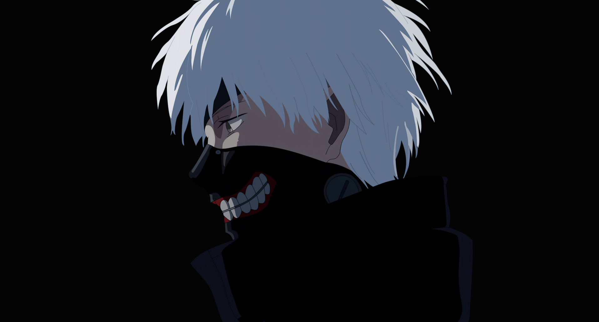

<div align="center">
  
  # 🎨 Pixelform Dotfiles Auto-Installer
  
  **Transform your Linux aesthetic in seconds.**
  
  <!-- PREVIEW SECTION -->
  
  

  <br><br>

  [](https://www.gnu.org/software/bash/)
  [](https://www.linux.org/)

</div>

---

## 🧩 Compatibility & Details

*   **Supported OS:** Debian, Ubuntu, Fedora, Arch Linux, OpenSUSE, Alpine.
*   **Wallpaper Support:** Works automatically on KDE Plasma, GNOME, Cinnamon, Xfce, and window managers (via `feh`).
*   **Directory Structure:** The scripts use **relative paths**. Do not move the `.sh` files outside the main folder, or they will lose access to the configuration files.

---

## ⚡ Quick Start (Recommended)

Don't want to read? Just copy and paste this entire block into your terminal to install **Fastfetch**, **Cava**, and the **Wallpaper** all at once.

```bash
# 1. Clone repository
git clone https://github.com/kloza15/pixelform-dotfile.git
cd pixelform-dotfile

# 2. Grant permissions and install everything
chmod +x *.sh && \
./1-install-fastfetch-v1-pixelform-dotfile.sh && \
./2-install-cava-v1-pixelform-dotfile.sh && \
./3-install-wallpaper-v1-pixelform-dotfile.sh
```

---

## 🛠️ Custom Installation (Advanced)

If you only want specific parts of the setup, run these scripts individually inside the folder:

| Component | Command | Description |
| :--- | :--- | :--- |
| **System Info** | `./1-install-fastfetch-v1-pixelform-dotfile.sh` | Installs Fastfetch, Fonts, and configures `.bashrc` / `.zshrc`. |
| **Visualizer** | `./2-install-cava-v1-pixelform-dotfile.sh` | Installs Cava and applies audio visualizer configs. |
| **Wallpaper** | `./3-install-wallpaper-v1-pixelform-dotfile.sh` | Detects your desktop (KDE/GNOME/etc.) and applies the background. |

---

## ⚠️ Important: Final Step

**To make the icons appear correctly, you must manually change your terminal font.**

The installer adds **Hack Nerd Font** to your system, but it cannot change your terminal settings for you.

1.  Open your Terminal **Settings** or **Preferences**.
2.  Find the **Font** or **Appearance** section.
3.  Select **"Hack Nerd Font"** (or just "Hack").
4.  *Restart your terminal to see the changes.*

---

## 🎮 How to Use

Once installed, here is how to control your new tools:

### 🖥️ Fastfetch (System Info)
It launches automatically when you open a terminal. To run it again manually:
```bash
fastfetch
```

### 🎵 Cava (Music Visualizer)
Play some music, then run:
```bash
cava
```
**Controls:**
*   `Arrow Keys`: Adjust sensitivity and bar width.
*   `Q`: Quit.

---

## 🆘 Troubleshooting & Common Issues

If you encounter any issues during or after installation, check the solutions below:

### 1. Permission Denied / Command Not Found
*   **Issue:** The terminal says permission is denied when running `./script.sh`.
*   **Solution:** You must make the scripts executable before running them.
    ```bash
    chmod +x *.sh
    ```
*   **Note:** Always run scripts using `./` (e.g., `./1-install...`). Do not simply type the filename.

### 2. Broken Icons (Squares/Boxes □□□)
*   **Issue:** You see squares instead of icons in Fastfetch.
*   **Solution:** This is strictly a **Font Issue**.
    1.  Run `fc-cache -fv` to refresh the system font cache.
    2.  **Mandatory:** Go to your Terminal Settings and manually change the font to **Hack Nerd Font**. The script cannot do this step for you.

### 3. Installation Fails / Freezes
*   **Issue:** The script stops midway or errors out.
*   **Solution:** Your package manager might be outdated or locked. Update your system manually before trying again:
    *   **Debian/Ubuntu:** `sudo apt update && sudo apt upgrade`
    *   **Arch:** `sudo pacman -Syu`
    *   Ensure basic tools are installed: `git`, `curl`, `unzip`.

### 4. Cava (Visualizer) Not Moving
*   **Issue:** Cava opens but the bars don't react to music, or it crashes.
*   **Solution:** Cava needs to know your audio driver.
    1.  Open config: `nano ~/.config/cava/config`
    2.  Find `[input]`.
    3.  Change `method` to `pulse`, `pipewire`, or `alsa` depending on your system.

### 5. Wallpaper Not Changing
*   **Issue:** The background remains the same or turns black.
*   **Solution:**
    *   **Desktop Environments (GNOME/KDE):** Try setting it manually from the `screenshots/` folder.
    *   **Window Managers (i3/bspwm):** The script uses `feh`. Ensure you have `feh` installed and add this to your startup file:
        ```bash
        feh --bg-scale /path/to/pixelform-dotfile/screenshots/wallpaper.png
        ```
